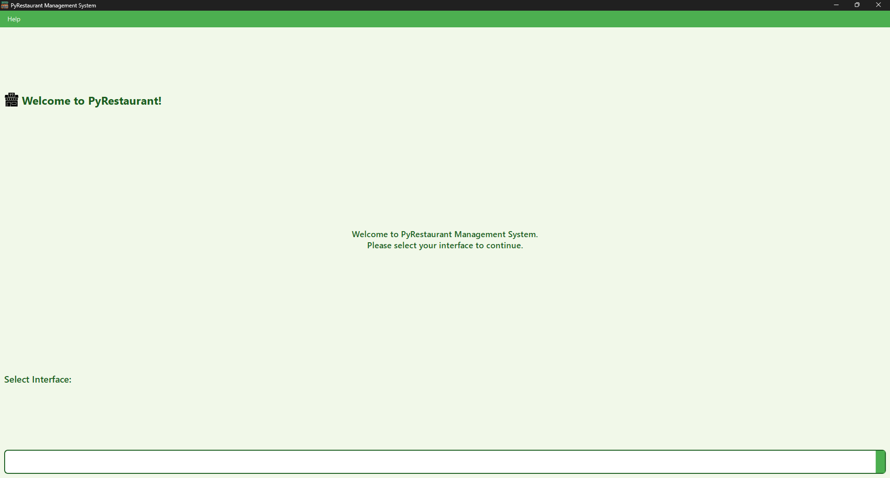
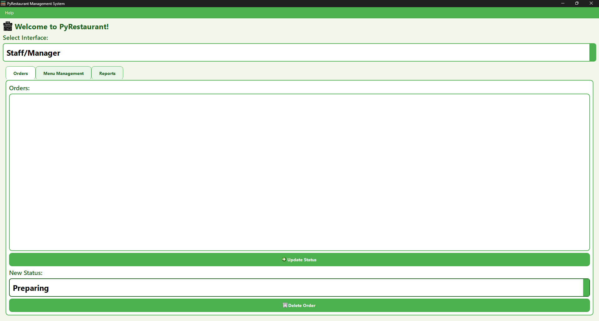
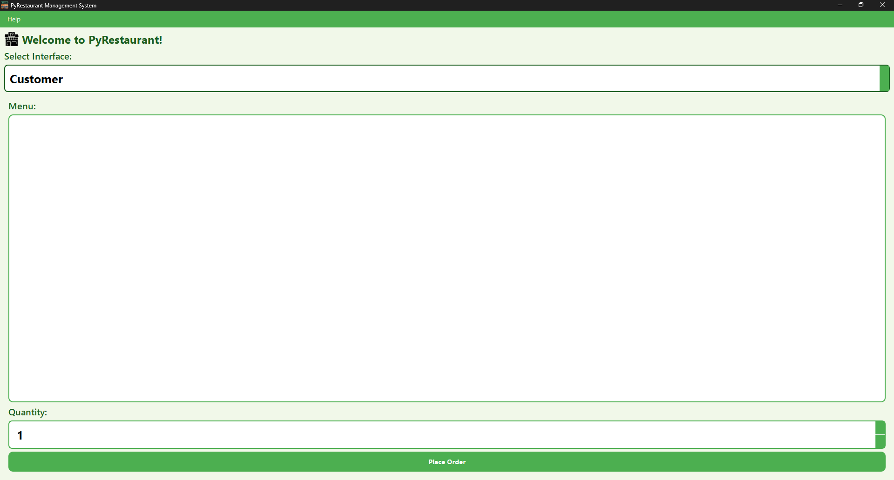

# PyRestaurant 🍽️

**Restaurant order management system built with Python, PyQt6, and SQLite.**  

---

## 📸 Screenshots

<p float="left">
  
  
  
</p>

---

## 🔧 Features

### Customer Interface
- Select dishes from the menu, specify quantity, and place orders.

### Staff / Admin Interface
- View orders and update status (Preparing ➔ Ready ➔ Completed).  
- Delete orders if necessary.

### Menu Management
- Add, edit, or delete dishes from the menu.

### Billing
- Calculate total of orders.  
- Generate PDF receipts using **ReportLab**.

### Reports
- Sales charts with **Matplotlib**.

### Database
- All data (menu, orders) stored in **SQLite**.

### Modern UI
- Built with **PyQt6** using icons, large fonts, colors, and tabs.

---

## 💻 Installation

1. Clone the repository:

```bash
git clone https://github.com/ahmetcakir-dev/PyRestaurant.git
```

2. Navigate into the project folder:

```bash
cd PyRestaurant
```

3. Install dependencies:

```bash
pip install -r requirements.txt
```

---

## 🚀 Usage

```bash
python PyRestaurant.py
```

- Launches the PyRestaurant application.  
- Customer and staff interfaces available.  

---

## 📑 Notes

- Default currency is **€**.  
- UI language is English.  
- Database file: `restaurant.db` in project root. 

---

## ⚡ Dependencies

- Python 3.10+  
- PyQt6  
- SQLite3  
- Matplotlib  
- ReportLab  

```
pip install pyqt6 matplotlib reportlab
```

---

## 📌 Author

**ahmetcakir-dev** - [GitHub](https://github.com/ahmetcakir-dev)
